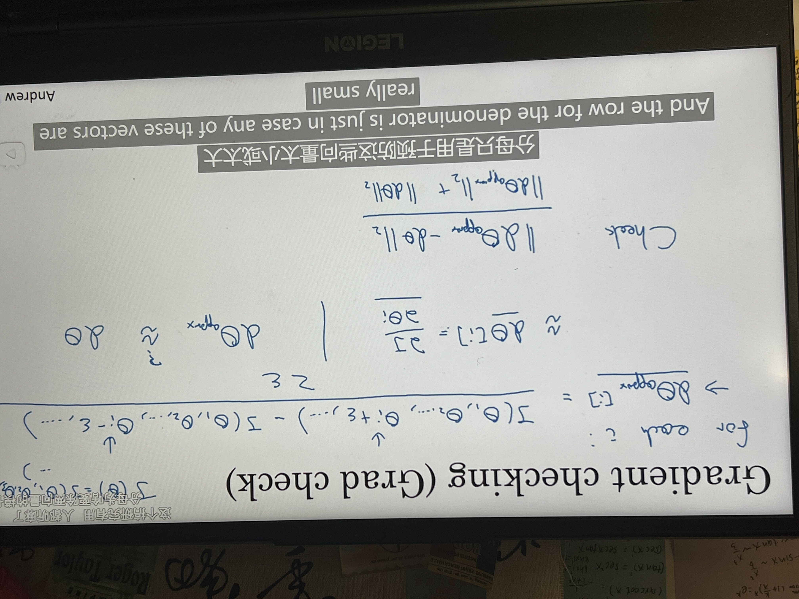

#归一化输入和梯度相关
##Normalizing training sets 归一化输入
作用：加速训练神经网络
###步骤：
1. 零均值化

$$
\mu = {1\over m}\sum\limits_{i=1}^mx^{(i)},x = x - \mu
$$

2. 归一化方差

$$
\textcolor{red}{\sigma^2} = {1 \over m}\sum\limits_{i=1}^mx^{(i)}**2,x /= \sigma^2
$$
  $\sigma^2$即为每个特征方差的平方的向量。

如果使用该方法来调整训练数据，则需要用相同的$\mu$和$\sigma^2$来归一化测试集。


**总结：使输入特征值x在相似范围内，更容易优化。**

##Vanishing / exploding gradients 梯度消失/梯度爆炸
因为z=w~1~x~1~+w~2~x~2~+...+w~n~x~n~，激活函数$\widehat{y}$呈指数级变化，要让z小则需要w~i~小。
###解决方法
$var(w^{[L]})={1\over n}$
```python
w[L] = np.random.randn(shape)*sp.sqrt(1/n[L-1])
```
* 若使用Relu函数，则g^[L]^(z)=Relu(z),$var(w^{[L]})={2\over n}$,w^[L]^ = np.random.randn(shape)*sp.sqrt(2/n^[L-1]^)
* 若使用tanh函数，则为$\sqrt{{1 \over n^{[L-1]}}}$ (即xavier initialization)
* 或者使用$\sqrt{{2 \over n^{[L-1]}+n^{[L]}}}$

##梯度检验
使用双边误差进行梯度检验
将参数变成一个大的向量$\theta$

令$\epsilon$=10^-7^,若结果与之相近，则可能没有bug，如若相差太大则说明存在bug。分母用来预防向量太小或太大，同时使方程式变成比率。
###需要注意的地方
1. 梯度下降的每一个迭代过程都不执行梯度检验。
2. 当梯度检验失败时，需要查找不同的i看看是哪个值的问题。
   即当某层的$d\theta$~approx~[i]和$d\theta$[i]相差很大时，而他们的dw^[L]^非常接近，此时则可能的是db^[L]^出了问题，其他同理。（$\theta$的各项与b和w的各项是一一对应的）。
   **总结：帮你估测需要在哪些地方追踪bug。**
3. 正则化后不要忘记第二个正则项$J(w,b) = {1 \over m} \sum\limits_{i=1}^mL(\widehat{y}^{(i)}，y^{(i)}) +\textcolor{red}{ {\lambda\over2m}\sum\limits_L\parallel w \parallel_F^2}
$，d$\theta$等于与$\theta$相关的J函数的梯度。
4. 很难用梯度检验来双重检验dropout的计算（他俩不同时使用）。
5. 当w和b接近0时，backpropagation的实施才是正确的。以下做法并不经常做：在随机初始化过程中进行梯度检验，再训练网络（若随机初始化值比较小w和b会有一段时间远离0），反复训练网络之后再重新进行梯度检验。

--- 
**2023/10/22**