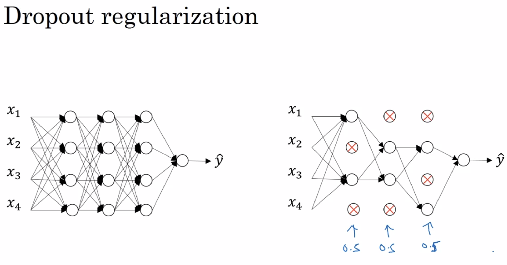

#正则化
避免过拟合/减少网络误差
##L~2~ regularization
$$J(w,b) = {1 \over m} \sum\limits_{i=1}^mL(\widehat{y}^{(i)}，y^{(i)}) + {\textcolor{red}{\lambda}\over2m}\parallel w \parallel_2^2
$$
>$\lambda$即为正则化参数，需要由验证集或交叉验证来确定。


$$ \parallel w \parallel_2^2 = w^T*w 
$$
* w作为一个高维参数矢量（包含很多参数），已经能够表达高方差问题，所以不用对b也进行正则化。
* 若用L~1~ regularization 会使得结果含有很多0，w将会变得稀疏。

$$ \parallel w^{[L]} \parallel^2 = \sum\limits_{i}^{n^{[L-1]}}\sum\limits_{j}^{n^{[L]}}(w_{ij}^{[L]})^2
$$
**Frobenius norm of a matrix**
$$
dw^{[L]} = (\text {from backpropagation}) + {\lambda \over m}w^{[L]}
w^{[L]} = w^{[L]} - \alpha dw^{[L]} = \textcolor{red}{w^{[L]}(1-{\alpha\lambda \over m})} - \alpha (\text {from backpropagation})
$$

* **红色部分即代表==权重衰减==，显示了正则化的作用即避免数据权值矩阵过大**


$\lambda$非常大时，W^[L]^约等于0（减小或“消除”隐藏单元影响，使得神经网络变得简单），此时权重矩阵下降导致Z下降，使得Z的范围更小，就会使激活函数偏线性，从而避免了过拟合。

调试梯度下降时，把代价函数J设计成
$$J(w,b) = {1 \over m} \sum\limits_{i=1}^mL(\widehat{y}^{(i)}，y^{(i)}) +\textcolor{red}{ {\lambda\over2m}\sum\limits_L\parallel w \parallel_F^2}
$$
**第二个正则项确保了J在所有调幅范围内单调递减**

##Dropout regularization

###inverted dropout(反向随机失活)
用d3表示一个三层的dropout向量，keep-prob表示保留某个隐藏单元的概率
```python
keep-prob = 0.8
d3 = np.random.rand(a3.shape[0],a3.shape[1]) < keep-prob #d3为一个布尔矩阵
a3 = np.multiply(a3,d3) #a3 *= d3
#过滤d3中等于0的元素
a3 /= keep-prob #确保数据分布的一致性
```
* 在测试阶段，我们不期望输出结果是随机的，所以不用dropout函数。
* 经过迭代后使得网络变得更小了，即达到了正则化的效果。
* We can't rely on any one feature, so we have to spread out weights.
* Dropout将产生收缩权重的平方范数的效果。
* L~2~对不同权重的衰减是不同的，它取决于倍增的激活函数的大小。
* 每一层的keep-prob可根据过拟合的可能性而相应改变，当keep-prob等于1时表示保留全部单元；可以只在一些特定层用，否则会出现很多超参数。
* 一般只在出现过拟合情况时使用dropout函数（计算机视觉研究）。
* 缺点：J不被明确定义，很难复查在迭代后是否是单调递减的，所以在画J的函数图时一般关闭dropout函数（keep-prob=1）。
* **dropout函数的结果是更新参数。**

ps:Dropout从以下两个方面缓解过拟合：
1. 防止特征检测器之间的共适应关系
2. 类似采用平均法进行模型集成

##Data augmentation(数据扩增)
通过将图片进行水平翻转或裁剪，或对字符进行一定程度的变形（直的变波浪形）等操作增大数据集（扩增算法数据）。

##Early stopping

当dev set error到达最低点时，即“神经网络已经表现得很好了”，就会选择该点，一般为mid-size$\parallel w \parallel_F^2$。
* 缺点：不能独立处理让J减小和不过拟合的任务
* 但是相对于L~2~找$\lambda$来说计算代价更小一些

---
**2023/10/20**